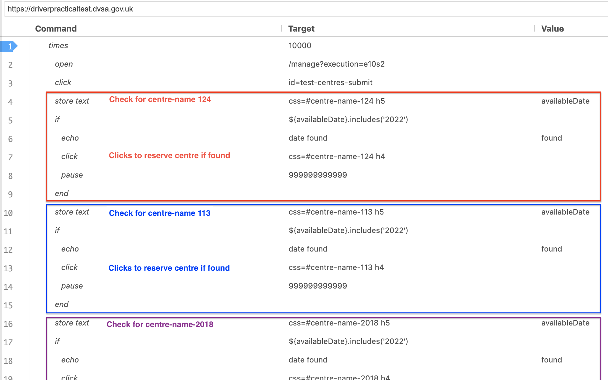
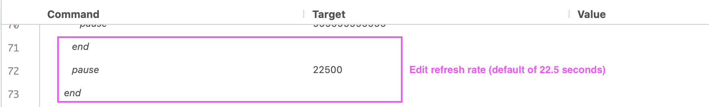

# UK Driving Test Booker
The COVID-19 pandemic has significantly impacted the driving test booking system in the UK, leading to a huge backlog of learners waiting to take their test. A combination of factors including limited test centres, a reduced number of examiners, and a surge in demand due to learners being unable to take lessons during lockdowns has created a challenging situation for those trying to book a test. Despite efforts to address the issue, the backlog remains a pressing concern for learner drivers across the country, making it virtually impossible to book a driving test at a reasonable date and location.

The only way to obtain an earlier driving test date is through cancellations by other learner drivers, and constantly checking and refreshing the website to get an earlier booking is time consuming and unfeasible. This script automates rebooking automation for UK drivers test cancellations on DVSA website.

# Instructions
1. Download Selenium IDE, refresh monitor and auto form fill extension from Chrome Web Store
2. Edit the script to your preferences with Selenium IDE (Import new project):
  - Change all instances of *"target": "${availableDate}.includes('**2022**')"* to your desired target year date. (default at 2022)
  - Change all instances of *"target": "css=**#centre-name-124 h5**"* to your desired test centers. One for *storetext* and one for the *click* statement. Check the centre names by inspecting DVSA page elements (ie. "target": "css=#centre-name-124 h4")
  - Change delay time before page refresh *"command": "pause","target": "**22500**"* on line 72 (default at 22.5s, around 30-60s per refresh recommended)
  - Change refresh url to updated DVSA test cancellation page *"urls": ["**https://driverpracticaltest.dvsa.gov.uk/**"]* (default url shown)
  - Change number of times to run script *"command": "times", "target": "**10000**"* on line 1 (default 10000 refreshes)
2. Upload .side script into the IDE (automatically clicking to check test centre availability, most centres likely to show 'no dates available')
3. Script should automatically click the first slot available in selected list (clicks the test dates when test satisfies criteria found), and reserves the booking slot for confirmation of reservation for 15 minutes. Manual input is required at this stage to secure the test slot, otherwise the reservation will timeout.
4. Clear cookies regularly to prevent captcha system from DVSA site.

# Annotated Selenium IDE code
Annotated code screenshots to better visualize script customization elements:

